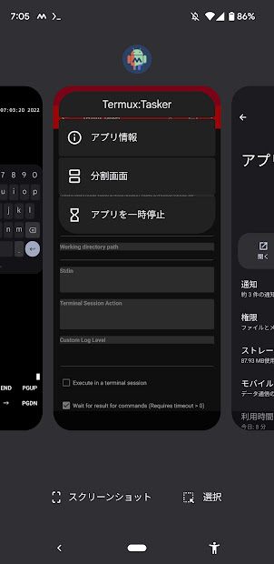
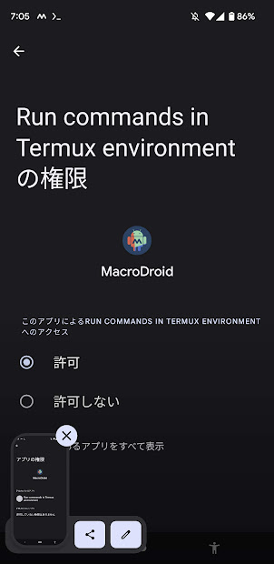
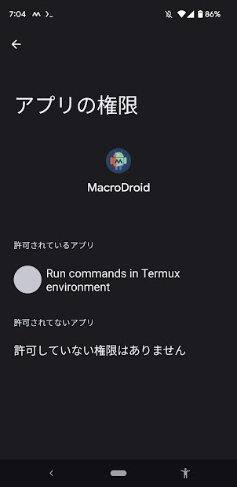

# termux_settings

スマホのショトカ設定 tmuxジャナイヨ！

## ショトカ等設定場所

```
/data/data/com.termux/files/home/.termux/termux.properties
/data/data/com.termux/files/usr/share/examples/termux/termux.properties
```

## setup

* 次回セットアップする時にスクリプトを試すのでとりあえず備忘録
* youtube-dl(2021.12.ver)は使用不可だった為，yt-dlpに移行したのでインストールしない
* 基本公式のリポジトリから直接インストールした
  * [yt-dlp](https://github.com/yt-dlp/yt-dlp/releases/latest/download/yt-dlp)
  * 2023.03.04 がmpvと上手く連携できていないので面倒なのでyt-dlp 2023.02.17で代替  
  [ダウンロードリンク](https://github.com/yt-dlp/yt-dlp/releases/download/2023.02.17/yt-dlp)と[リリースページ](https://github.com/yt-dlp/yt-dlp/releases/)
  * ダウンロードするファイルは無印(yt-dlp)でOKでダウンロード後は実行権限も付与しておく

* [ ] curlでダウンロードしパスの設定を変える
* [ ] スマホ側でのmacrodroid等の権限管理に関するスクショの追加

```
touch .config/mpv/mpv.conf 
echo 'script-opts=ytdl_hook-ytdl_path=/data/data/com.termux/files/home/downloads/yt-dlp' > .config/mpv/mpv.conf
```

> curlでダウンロードしパスの設定を変える\
例
>
>```
> sudo curl -L https://yt-dl.org/downloads/latest/youtube-dl -o /usr/local/bin/youtube-dl
> ln -sf /data/data/com.termux/files/{home/downloads/yt-dlp,usr/bin/} #latest
> sudo chmod a+rx /usr/local/bin/youtube-dl
>```

```
git clone https://github.com/keito1029/termux_settings
cp -r termux_settings/tasker .termux/
```

> このリポジトリをcloneして目覚まし用のshellをコピー，これによりtaskerディレクトリも作成

```
apt update && apt upgrade -y termux-setup-storage  apt update && apt install -y vim curl python ffmpeg cronie termux-services && pip install --yes mpv && crontab -i ~/termux_settings/cron.txt && exit
```

> 再起動しないとcrontabを起動できない

```
sv-enable crond
```

## about acquire waylock

```
touch ~/.profile ~/.bash_logout 
```

## macrodroidとの権限やそれぞれのヘルパーアプリを確認

[参考文献](https://gist.github.com/txoof/f7670b80e983582f7af6d1a7791c15ab)

# taskerはFdroidはF-droidより [無料](https://f-droid.org/en/packages/com.termux.tasker/)でインストールできるので注意

## Run commands in Termux environment の権限

macrodroidのtaskerを開いた状態じゃないと権限が追加されず許可できないので注意





## URLの動画を見れる様にする


## note

* termuxのモバイルネットワーク制限は [できない](https://github.com/termux/termux-app/issues/1556)
* ポート番号は8022 
